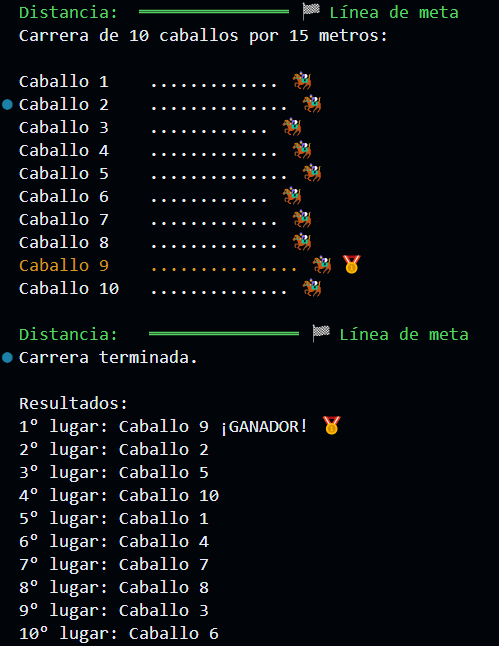

# Seminario de Programación Paralela y Concurrente UNSAM 2°C-2025  

---
## Entrega 1 - Carrera de caballos  
* [Script de carrea de caballos](./entrega1/horsesRace.py)  

---
## Entrega 2 - Exclusión Mutua   
* [Listado de ejercicios](./entrega2/README.md)

--- 
### Trabajo Práctico Final  
[TPF - Modelado de Operaciones Aritméticas Binarias mediante Redes de Petri](https://github.com/MelOviedo/tpf_seminario_de_programacion_2c_2025)  
